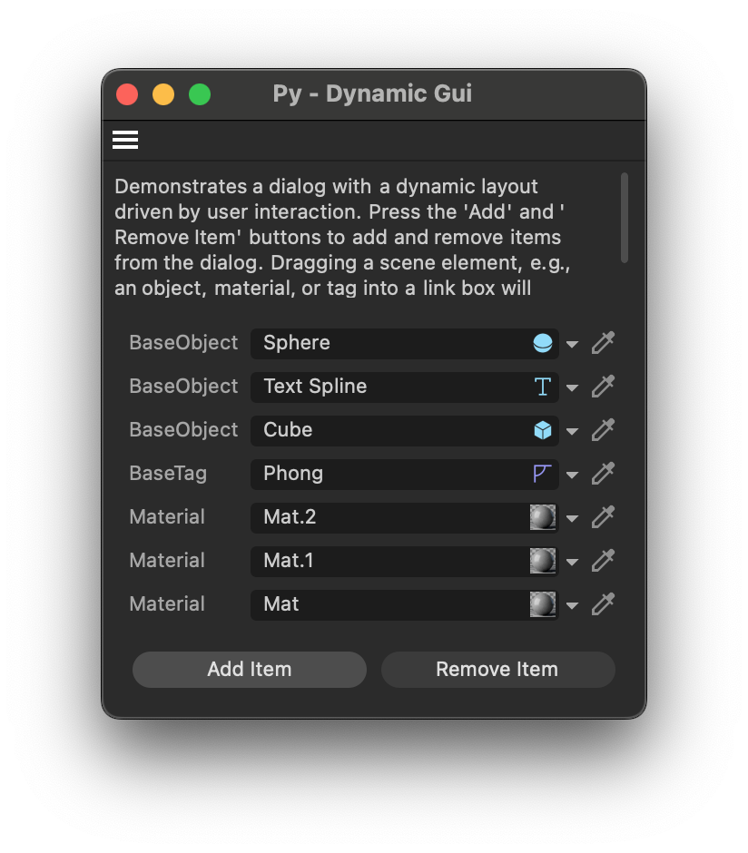

# Py - Dynamic Gui Example

Demonstrates a dialog with dynamically addable and removable GUI elements.

Open this dialog example by running the command "Py - Dynamic Gui" in the Commander (Shift + C).
The user can add and remove 'items' to the dialog, which are represented by link boxes. Dragging a
scene element such as an object, material, or tag into the link box will then update the label of
that previously empty or otherwise linked link box to the type name of the dragged item, e.g.,
"BaseObject". So, the two dynamic aspects are adding and removing items from the dialog and the
labels updating when the user drags an item into a link box.

Also shown is here the idea of a data model abstraction layer, which is not strictly necessary, but
can be useful when one wants to have a more structured way of dealing with the data in a dialog.
This is here realized as the property `Items` of the `DynamicGuiDialog` class, which allows us to
just invoke `myDynamicGuiDialog.Items = [a, b, c]` for the dialog then to rebuild its UI and
show the items `a`, `b`, and `c` in three link boxes.

#### Subjects

- Using GeDialog to create a dialog with dynamic content.
- Using a simple data model abstraction layer to simplify interaction with the dialog. Here
    we realize DynamicGuiDialog.Items as a property that can bet set and get, and upon
    setting the property, the dialog will rebuild its UI.
- Using GeDialog.LayoutFlushGroup() to clear a group of gadgets and LayoutChanged() to notify
    Cinema 4D that the layout has changed.
- Using GeDialog.AddCustomGui() to add custom GUI elements (here link boxes).