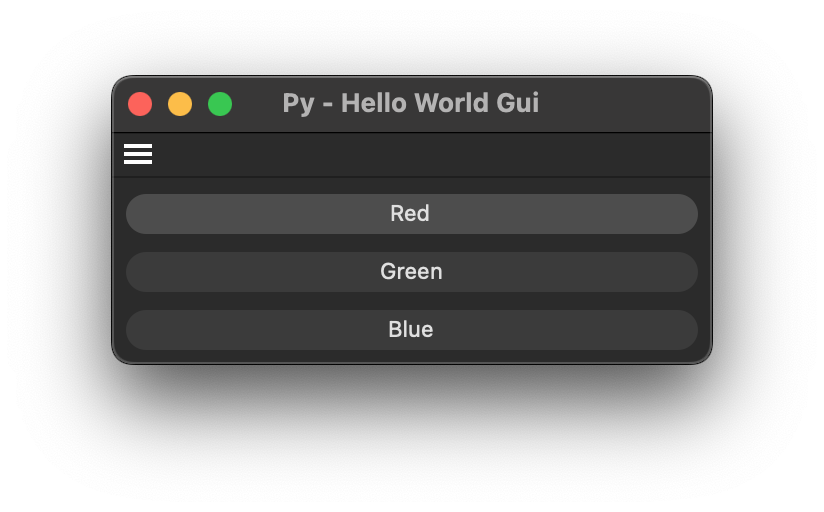

# Py - Hello World Gui Example

Demonstrates the most basic command/dialog plugin possible, this is not only a command hello world example, but generally a plugin hello world example.

Open this dialog example by running the command "Py - Hello World Gui" in the Commander (Shift + C). 
This is a very simple dialog example, which demonstrates how to create a dialog with three buttons
that display a message when clicked.

#### Subjects

- GeDialog.CreateLayout() and its most basic usage to build a GUI.
- GeDialog.Command() to handle user input.
- CommandData.Execute() to open the dialog.
- Registering a command plugin that manages a dialog.
