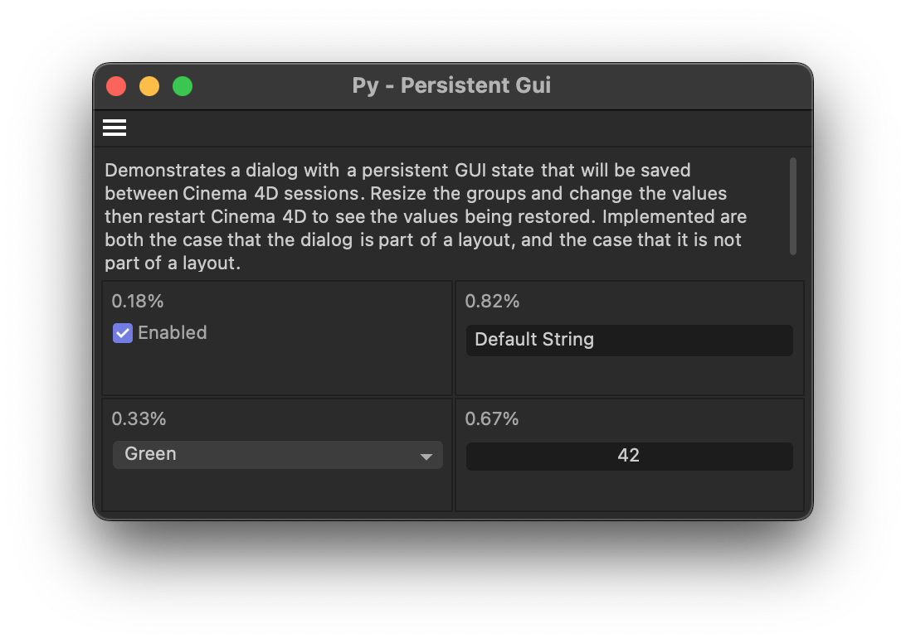

# Py - Persistent Gui Example

Demonstrates how to store dialog layout data and values persistently over dialog open/close
and Cinema 4D restart boundaries.

Demonstrates how to store dialog layout data and values persistently over dialog open/close and Cinema 4D restart boundaries.

Open this dialog example by running the command "Py - Persistent Gui" in the Commander (Shift + C). The dialog contains four groups whose size can be adjusted by the user, and one GUI element in each group. The group weights and gadget values will persist when the dialog is closed and reopened, the user switches a layout, or when Cinema 4D is restarted.

#### Note

Cinema 4D itself heavily relies on layout files these days to persistently store dialog layouts. But third party plugins often are not part of a layout file, and therefore cannot rely on the layout file system for this purpose.

This example uses custom serialization and deserialization to cover all possible boundaries (open/close and restart) over which values should be preserved. This is only relevant for the case when the dialog is not part of a layout file.

The relevant code sections have been marked with "@RestartPersistence", and there is also the `py-cmd_gui_persistent_no_restart` example which does not use custom serialization and deserialization, i.e., has these sections removed. See the other example for a simpler implementation, but that does not persist over Cinema 4D restarts.

#### Subjects

- Layout support for dialogs via BFM_LAYOUT_GETDATA and BFM_LAYOUT_SETDATA.
- Using BFV_GRIDGROUP_ALLOW_WEIGHTS to allow the user to resize groups in a dialog.
- Using GeDialog.GroupWeightsSave() and GroupWeightsLoad() to manage group weights.
- Custom hyper file serialization and deserialization of dialog values.