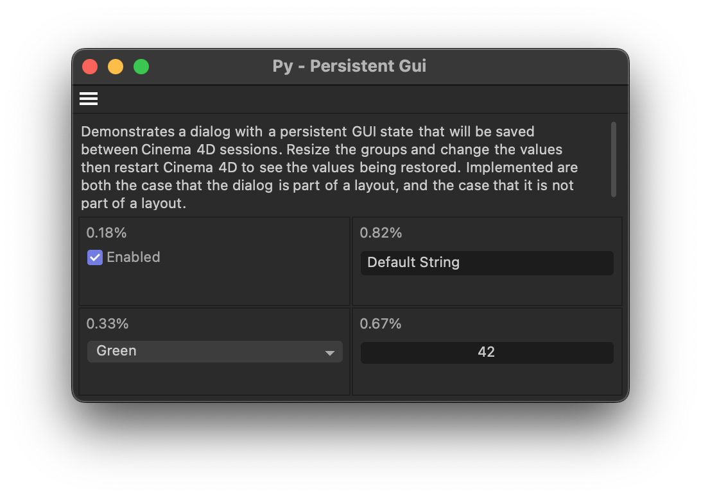

# Py - Persistent Gui Example

Demonstrates a simple way to store dialog layout data and values persistently over dialog open/close boundaries (but not over Cinema 4D restart boundaries).

Open this dialog example by running the command "Py - Persistent Gui" in the Commander (Shift + C). The dialog contains four groups whose size can be adjusted by the user, and one GUI element in each group. The group weights and gadget values will persist when the dialog is closed and reopened or the user switches a layout.

#### Note

Cinema 4D itself heavily relies on layout files these days to persistently store dialog layouts. But third party plugins often are not part of a layout file, and therefore cannot rely on the layout file system for this purpose.

This example is a slimmed down version of the `py-cmd_gui_persistent` example which does not use custom serialization and deserialization to make the dialog persistent over Cinema 4D restart boundaries. The dialog will still persistently store its group weights and values within the layout files, and over dialog open/close boundaries.

See the other example for a more complex implementation that uses custom serialization and deserialization to persistently store the dialog layout data and values over Cinema 4D restart boundaries.

#### Subjects

- Layout support for dialogs via BFM_LAYOUT_GETDATA and BFM_LAYOUT_SETDATA.
- Using BFV_GRIDGROUP_ALLOW_WEIGHTS to allow the user to resize groups in a dialog.
- Using GeDialog.GroupWeightsSave() and GroupWeightsLoad() to manage group weights.