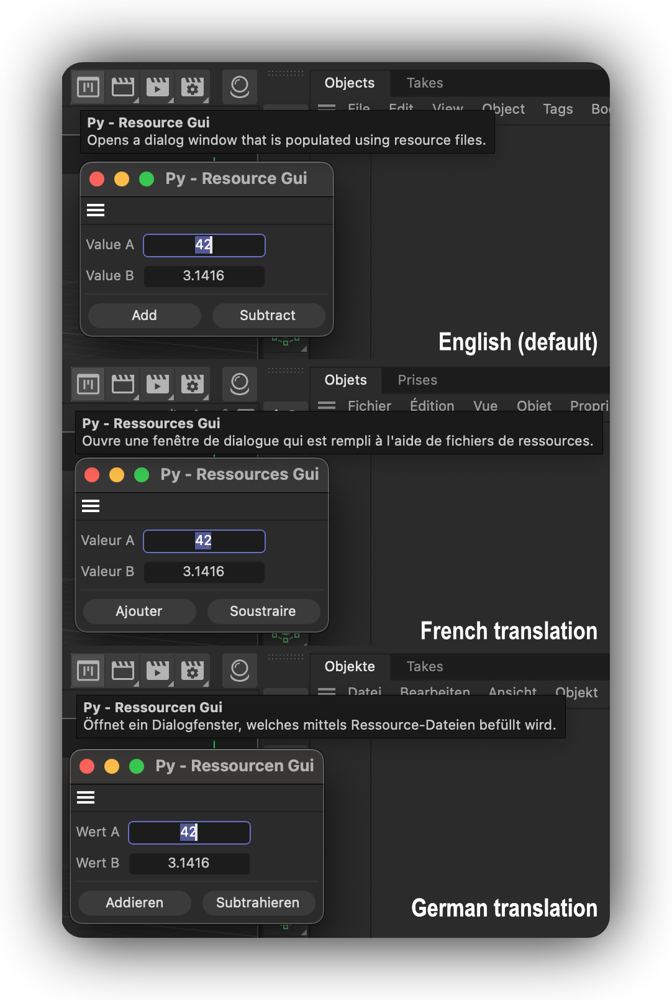

# Py - Resource Gui Example

Demonstrates a plugin that uses resources to define its dialog layout and string translations.



Open this dialog example by running the command "Py - Resource Gui" in the Commander (Shift + C). 
The dialog itself is not very complex, but it demonstrates how to use resources to define the layout
of a dialog.

Plugins store their resources in a folder named "res" next to the plugin module (the pyp file in
Python). Such resource folder can contain a wider variety of resources, but one important aspect
are *.res, *.str, and h.files, defining description resources (the UI types used by scene elements 
such as materials, objects, and tags), and dialog resources. This example focuses on dialog
resources. A res folder for a plugin using dialog resources could look like this:

```txt
    myPlugin/                               # The plugin folder.
    ├── myPlugin.pyp                        # The plugin module.
    └── res/                                # The resources of the plugin.    
        ├── c4d_symbols.h                   # The global symbols of the plugin, here are all non
        │                                    # description, i.e., dialog, IDs defined.
        ├── dialogs/                        # The dialog resources of the plugin, here we can find
        │   |                                 # the markup that defines dialogs.
        │   ├── idd_values.res              # A dialog GUI markup file.
        │   └── idd_buttons.res             # Another dialog GUI markup file.
        ├─── strings_en-US/                 # The English strings for the plugin used by resources.
        │   ├─ dialogs/                     # The English dialog strings for the plugin.  
        │   │   ├── idd_values.str          # The strings for the IDD_VALUES dialog.
        │   │   └── idd_buttons.str         # The strings for the IDD_BUTTONS dialog.
        │   └─ c4d_strings.str              # Generic English strings for the plugin.
        └─── strings_de-DE/                 # The German strings for the plugin used by resources.
             ...
````

Cinema 4D currently supports the following languages:

- en-US: English (default language, fallback when no translation is available, all plugins must have this language defined)
- ar-Ar: Arabic
- cs-CZ: Czech
- de-DE: German
- es-ES: Spanish
- fr-FR: French
- it-IT: Italian
- ja-JP: Japanese
- ko-KR: Korean
- pl-PL: Polish
- pt-BR: Brazilian Portuguese
- zh-CN: Simplified Chinese

> WARNING: All languages that use non-ASCII characters, such as Chinese, French, German, require their special unicode characters to be decoded to ASCII escape sequences in the *.str files. E.g., '品' must become '\u54c1', an 'é' must become '\u00e9', "ä" must become "\u00e4", and so on. Cinema 4D offers no builtin tool to do this, but the example script `unicode_encode_strings.py` shipped next to this example can be a starting point for a conversion pipeline.

#### Subjects

- Defining  dialog resources in a resource file.
- Loading dialog resources with GeDialog.LoadDialogResource().
- Loading string translations with c4d.plugins.GeLoadString().
- Purpose of __res__ in a plugin module and how to manually load a resource.
