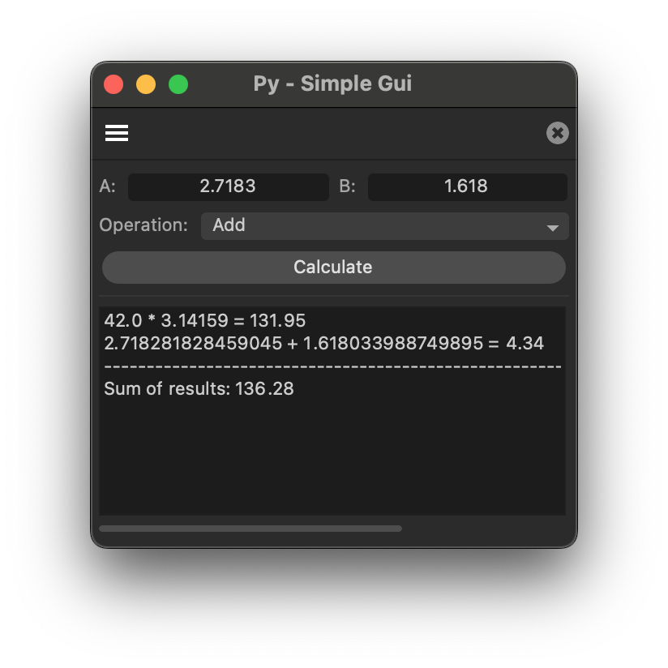

# Py - Simple Gui Example

Demonstrates a simple dialog with two number input fields, a combo box and a button to
carry out numeric operations on the two numbers.

Open this dialog example by running the command "Py - Simple Gui" in the Commander (Shift + C). This
is a very simple dialog example, which demonstrates how to create a dialog with a few gadgets, how 
to handle user input, and how to display results in a multi-line edit text field.

#### Subjects

- GeDialog.CreateLayout() and how to use it build a GUI.
- GeDialog.InitValues() to set initial values of the dialog.
- GeDialog.Command() to handle user input.
- Using a custom GUI.
- Implementing a very simple gui-value abstraction.
- The pattern for implementing a command plugin that manages a dialog.
