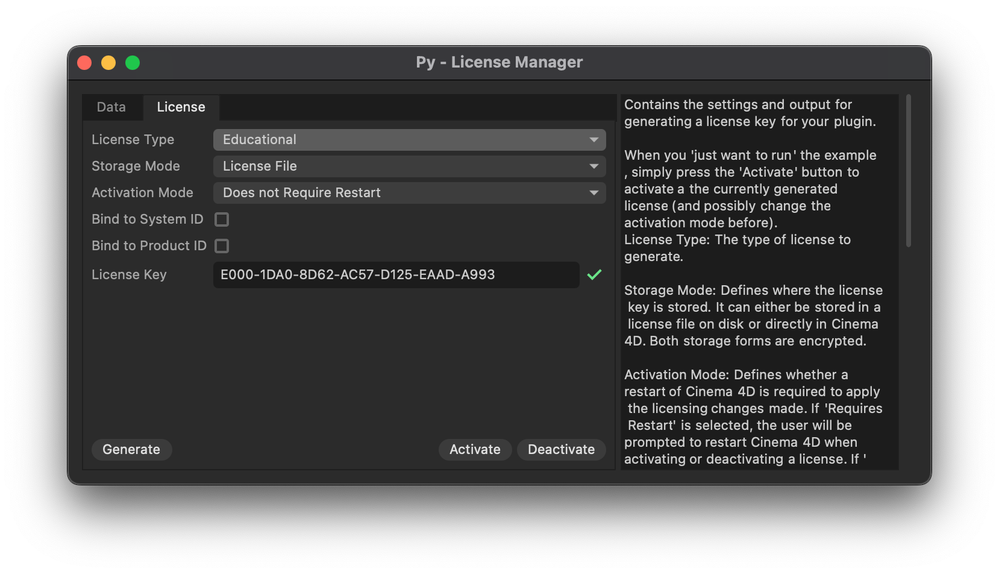

# Py Licensing 2026 Example

Demonstrates how to implement licensing checks in plugins.

Licensing plugins is an important aspect of commercial plugin development but also a very complex subject. This set of examples attempts to give an overview of different licensing concepts and how they can be implemented in Python plugins for Cinema 4D.

In Python, the subject of licensing is complicated by the fact that Python code by definition is insecure, as source code must be sent as plain text to the interpreter to be executed. All Python *'obfuscation'* measures - be it the built in encryption of Cinema 4D `.pyp` files or third party tools such as `pyarmor` or `nuitka` - cannot prevent this. A motivated and only mildly competent attacker will always be able to easily decrypt your code and remove any licensing checks you have implemented. Due to that, licensing should always be implemented in a "keep honest users honest" manner in Python.

## Content

| File | Description |
|------|-------------|
| `py-licensing.pyp` | Demonstrates multiple licensing workflows for Python plugins in Cinema 4D. |
| `py-licensing_simple.pyp` | A simplified version of the main licensing example, demonstrating only a single licensing concept. |

## Concepts not Demonstrated

Concepts that are important but explicitly not shown in these examples are:

- Online license validation with a REST or similar web service. But the general code structure provides a place with `PluginMessage` (`C4DPL_STARTACTIVITY`) and `ValidateSerial`.
- Trial Periods or general license time limits encoded into license keys. The example hints at as where this could be done, but does not implement it.

## Concepts Demonstrated

- `py-licensing_simple.pyp`
  - Simple file based license storage in the user's preferences folder.
  - Restart based activation workflow.
  - Simple hashing scheme for license keys.
- `py-licensing_simple.pyp`
  - Internalized license storage.
  - File based license storage.
  - Restart based activation workflow.
  - No-restart based activation workflow.
  - Simple hashing scheme for license keys.
  - Dynamic enabling/disabling of plugin functionality based on licensing state.
  - GUI based license manager dialog.